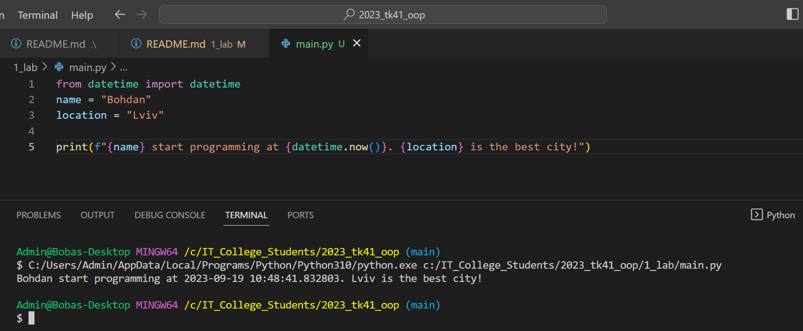

# Звіт до роботи №1
## Тема: Оформлення робіт та перша програма на Python.
### Мета роботи: Навчитись оформлювати роботи з допомогою форматування Markdown та написати першу програму на Python.
---
### Виконання роботи
- Результати виконання завдання:
    1. Створено файл з розширенням `.py` та напитсано першу програму яка знаходиться у файлі [main.py](main.py);
    1. Результат виконання програми на скріншоті: 
    1. Створили [Python Notebook](nb.ipynb) та додали пояснення до коду;
    1. Модифікували програму додавши використання бібліотеки `time` та запитались у ChatGPT як перевести час з Еpoch до нормального (зрозумілого людині);
    1. Навчились створювати та запускати програми на Python, працювати в Python Notebook, та за допомогою ChatGPT модифікували нашу першу програму.

- попрактикувались вставляти код та результат простим копіюванням:
```python
from datetime import datetime
name = "Bohdan"
location = "Lviv"

print(f"{name} start programming at {datetime.now()}. {location} is the best city!")
```
Програма вивела:
```text
Admin@Bobas-Desktop MINGW64 /c/IT_College_Students/2023_tk41_oop (main)
$ C:/Users/Admin/AppData/Local/Programs/Python/Python310/python.exe c:/IT_College_Students/2023_tk41_oop/1_lab/main.py
Bohdan start programming at 2023-09-20 12:49:39.865234. Lviv is the best city!
```

- небуло;

### Висновок: 
> у висновку потрібно відповісти на запитання:
- :white_check_mark: Що зроблено в роботі: виконали першу програму на Python, попрацювати у Python Notebook, задали запит ChatGPT та оформили звіт;
- :question: Чи досягнуто мети роботи: :+1:
- :question: Які нові знання отримано: навчились працювати з Python в інтерактивному режимі використовуючи Notebook :notebook: ;
- :question: Чи вдалось відповісти на всі питання задані в ході роботі: :white_check_mark:
- :question: Чи вдалося виконати всі завдання: :white_check_mark:
- :question: Чи виникли складності у виконанні завдання: :white_check_mark:
---